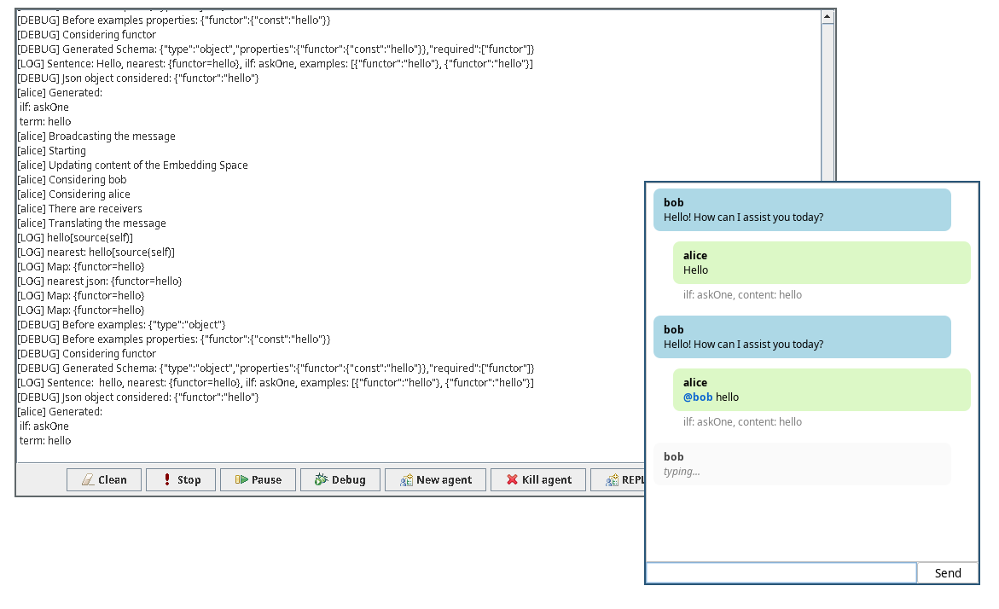

# ChatBDI: Think BDI, Talk LLM

ChatBDI is a framework for building a middle-agent allowing natural language interaction between humans and (also legacy) software agents in [JaCaMo](https://jacamo-lang.github.io/). The [AAMAS 2025 extended abstract](Extended_Abstract_CRC____AAMAS_2025_ChatBDI.pdf) describing ChatBDI can be cited as   

Gatti, A., Mascardi, V., Ferrando, A.: ChatBDI: Think BDI, talk LLM. In: Vorobeychik, Y., Das, S., Nowé, A. (eds.) 24th International Conference on Autonomous
Agents and Multiagent Systems (AAMAS 2025). International Foundation for Autonomous Agents and Multiagent Systems (2025)


| Hello World |
|---|
|  |

With ChatBDI you can insert the user inside your multi-agent system. ChatBDI provides a chat interface:
 - each message sent via broadcast or sent specifically to the ChatBDI agent is displayed on the chat;
 - user can send messages without recipients to make a broadcast or with one or more `@recipient` to perform a send to single agents.

ChatBDI provides also a set of plans to instrument the agents present in the mas to perform actions and provide information.

You can substitute one of the agents as shown in `examples/auction_ag/` example or add a totally new agent to the mas, for example for explainability purposes as in `examples/domestic_robot/`.

The examples available are:

| Auction Example | Domestic Robot Example | House Building |
|---|---|---|
|  | | |

## Usage
> [!IMPORTANT]
>
> **Requirements**
>
> - Java 23 (if you change version remember to change it in the `build.gradle` file)
> - Gradle (tested with version 8.13)

To run the demo you can simply enter the interpreter folder and run it. This is a simple "echo" mas.

```bash
cd interpreter
gradle run
```

The framework provides:

- a chat GUI component;
- an Agent Architecture (AgArch) for natural language interpretation;
- integration with LLM models for translation between natural language and logical properties.

The structure of the project should follow this:
```
├── build.gradle
├── your_mas.mas2j (or .jcm for JaCaMo)
└── src
    ├── agt
    │   ├── agent_1.asl
    │   ├── ...
    │   ├── agent_n.asl
    │   └── chatbdi
    │       ├── Interpreter.java
    │       ├── ChatUI.java
    │       ├── Ollama.java
    │       ├── EmbeddingSpace.java
    │       ├── Tools.java
    │       └── modelfiles/
    │           ├── nl2logPrompt.txt
    │           ├── log2nlPrompt.txt
    │           ├── nl2log.txt
    │           ├── log2nl.txt
    │           └── classifier.txt
    └── env
        └── your_classes.java
```

The `src/agt/chatbdi/` folder contains the `Interpreter` agent architecture class and all supporting components for natural language interaction.

### Turning a Jason Agent into a natural language interpreter

> [!NOTE]
>
> Remember to follow these steps:
>
> 1. configure the agent with the `chatbdi.Interpreter` agent architecture;
> 2. provide model file paths and model names in the agent configuration;
> 3. define the message handling plans.

To make an agent an interpreter, configure it in your `.mas2j` (Jason) or `.jcm` (JaCaMo) file with the agent architecture and required parameters:

```mas2j
agents:
    your_agent your_agent.asl [
        nl2log_prompt = "path/to/nl2logPrompt.txt",
        log2nl_prompt = "path/to/log2nlPrompt.txt",
        nl2log_model = "path/to/nl2log.txt",
        log2nl_model = "path/to/log2nl.txt",
        class_model = "path/to/classifier.txt",
        gen_model = "qwen2.5-coder",
        emb_model = "all-minilm"
    ]
    agentArchClass chatbdi.Interpreter;
```

The agent architecture **automatically**:
- Captures user input from the chat UI
- Classifies the performative (tell, askOne, askAll) using the LLM
- Translates natural language to logical properties using embeddings
- Sends messages to the appropriate agents
- Intercepts incoming KQML messages and translates them to natural language
- Displays all messages in the chat interface

Your agent file can be completely empty - the agent architecture handles all the natural language interaction.

#### Example

The simplest ChatBDI agent file can be completely empty:

```jason
// The agent architecture handles all natural language interaction
```

All the work is done by the `Interpreter` agent architecture, which:
- Automatically captures user input from the chat interface
- Translates natural language → logical properties using LLM and embeddings
- Classifies performatives and sends KQML messages to other agents
- Intercepts all incoming messages and translates them to natural language
- Displays everything in the chat UI

You can still add custom plans to your agent for domain-specific behavior - the architecture just adds the natural language layer on top.

### Understanding the Interpreter Architecture

The `Interpreter` class extends Jason's `AgArch` (Agent Architecture) and provides:

1. **Automatic Knowledge Base Management**: The architecture automatically accesses all agents' belief bases and plan libraries to build an embedding space for translation.

2. **LLM Integration**: Uses Ollama to:
   - Classify user messages into performatives (tell, askOne, askAll)
   - Generate logical properties from natural language input
   - Generate natural language from KQML messages

3. **Chat Interface**: The `ChatUI` component displays messages and provides user interaction.

4. **Embedding Space**: Uses embeddings to find the most similar beliefs/plans to user input for context-aware translation.

The main internal methods:
- `nl2kqml()`: translates natural language to KQML messages (uses classification + generation)
- `kqml2nl()`: translates KQML messages to natural language
- `handleUserMsg()`: processes user input and sends to agents
- `checkMail()`: intercepts agent messages and displays them

The architecture implementation can be found at [interpreter/src/agt/chatbdi/Interpreter.java](interpreter/src/agt/chatbdi/Interpreter.java).

## Examples

In this repo are present two examples taken from the JaCaMo repository and adapted:

- **Auction Example**: one auctioneer and four participants, the user is one of the participants (http://jacamo-lang.github.io/jacamo/tutorials/coordination/readme.html);
- **Domestic Robot**: one owner, one robot and one supermarket, the user is added only to understand which are the agent and what they can do (adapted to JaCaMo from https://github.com/jason-lang/jason/tree/main/examples/domestic-robot);
- **House Building**: one house builder, many companies and one user that wants to build a house (taken from https://github.com/jacamo-lang/jacamo/tree/main/examples/house-building).

These three projects use the `Interpreter` agent architecture that uses LLM and embeddings to translate from natural language to logical properties and vice versa.

To run these examples you need a further step, install **Ollama** (https://ollama.com/) and pull the required models. The default configuration uses `qwen2.5-coder` for generation and `all-minilm` for embeddings (you can change them in the agent configuration in the .mas2j or .jcm file).

```bash
ollama pull qwen2.5-coder
ollama pull all-minilm
ollama serve
```

Next you can start the project with gradle:

```bash
cd examples/jason/auction  # or examples/jacamo/auction, etc.
gradle run
```

## Bibtex 

@inproceedings{chatBDI-aamas,  
  author    = {Andrea Gatti and Viviana Mascardi and Angelo Ferrando},  
  title     = {{ChatBDI}: Think {BDI}, Talk {LLM}},  
  booktitle = {24th International Conference on Autonomous Agents and Multiagent Systems (AAMAS 2025)},  
  publisher = {International Foundation for Autonomous Agents and Multiagent Systems},  
  year      = {2025},  
  editor = {Y. Vorobeychik and S. Das and A. Nowé}  
}
