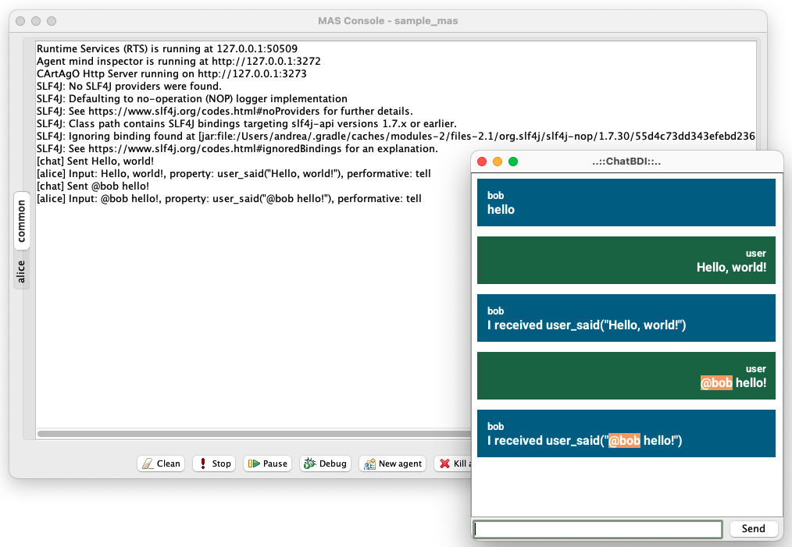
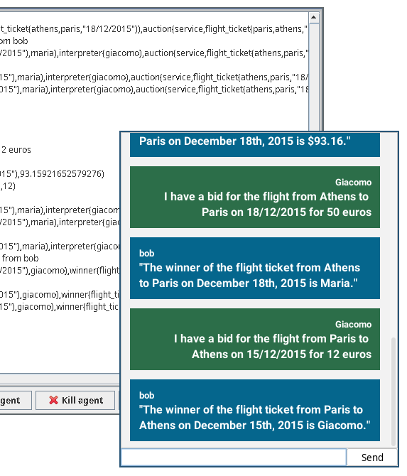
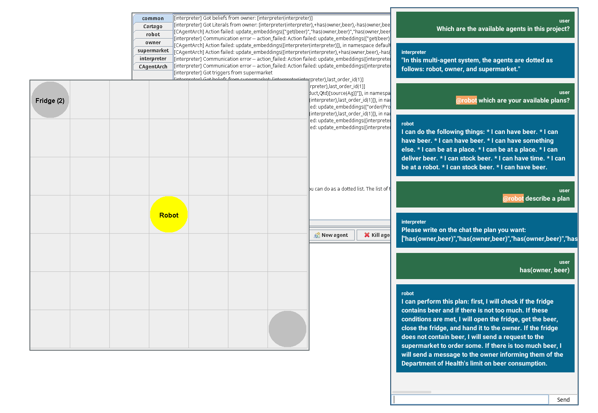
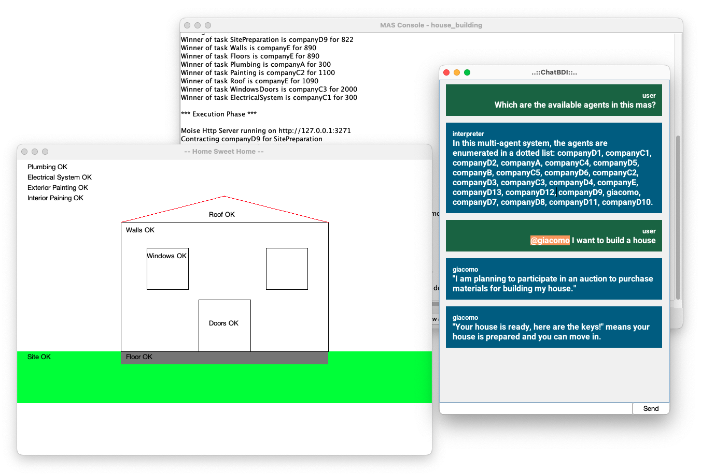

# ChatBDI: Think BDI, Talk LLM

ChatBDI is a framework for building an interpreter agent using [JaCaMo](https://jacamo-lang.github.io/). The [AAMAS 2025 extended abstract](Extended_Abstract_CRC____AAMAS_2025_ChatBDI.pdf) describing ChatBDI can be cited as   
Gatti, A., Mascardi, V., Ferrando, A.: ChatBDI: Think BDI, talk LLM. In: Vorobeychik, Y., Das, S., Nowé, A. (eds.) 24th International Conference on Autonomous
Agents and Multiagent Systems (AAMAS 2025). International Foundation for Autonomous Agents and Multiagent Systems (2025)

@inproceedings{chatBDI-aamas,  
  author    = {Andrea Gatti and Viviana Mascardi and Angelo Ferrando},  
  title     = {{ChatBDI}: Think {BDI}, Talk {LLM}},  
  booktitle = {24th International Conference on Autonomous Agents and Multiagent Systems (AAMAS 2025)},  
  publisher = {International Foundation for Autonomous Agents and Multiagent Systems},  
  year      = {2025},  
  editor = {Y. Vorobeychik and S. Das and A. Nowé}  
}  


| Hello World |
|---|
|  |

With ChatBDI you can insert the user inside your multi-agent system. ChatBDI provides a chat interface:
 - each message sent via broadcast or sent specifically to the ChatBDI agent is displayed on the chat;
 - user can send messages without recipients to make a broadcast or with one or more `@recipient` to perform a send to single agents.

ChatBDI provides also a set of plans to instrument the agents present in the mas to perform actions and provide information.

You can substitute one of the agents as shown in `examples/auction_ag/` example or add a totally new agent to the mas, for example for explainability purposes as in `examples/domestic_robot/`.

The examples available are:

| Auction Example | Domestic Robot Example | House Building |
|---|---|---|
|  | | |

## Usage
> [!IMPORTANT]
>
> **Requirements**
>
> - Java 23 (if you change version remember to change it in the `build.gradle` file)
> - Gradle (tested with version 8.13)

To run the demo you can simply enter the interpreter folder and run it. This is a simple "echo" mas.

```bash
cd interpreter
gradle run
```

The framework provides:

- a chat GUI artifact;
- an Interpreter artifact interface;
- an set of interpreter actions.

The structure of the project should follow this:
```
├── build.gradle
├── your_mas.jcm
└── src
    ├── agt
    │   ├── agent_1.asl
    │   ├── ...
    │   ├── agent_n.asl
    │   │
    │   ├── interpreter
    │   │   ├── list_beliefs.java
    │   │   ├── list_plans.java
    │   │   └── list_useful_literals.java
    │   └── interpreter.asl
    └── env
        ├── your_classes.java
        └── interpreter
            ├── ChatArtifact.java
            ├── Interpreter.java
            └── YourInterpreter.java
```

Inside the `src/agt/` folder the `interpreter` folder contains a set of custom `InternalActions` used only with the instrumentation active. The folder `interpreter` insider `src/env/` instead contains the `Artifacts` used by ChatBDI.

### Make an Agent an Interpreter

> [!NOTE]
>
> Remember to follow these three steps:
>
> 1. include the `interpreter.asl` file;
> 2. add the beliefs for instrumentation and interpreter class;
> 3. define the io plans.

Placed the framework files as shown, to make an agent an interpreter it is sufficient to add this line to your code:

```
{ include( "interpreter.asl" ) }
```

The agent should then have two beliefs:

- `instrumentation(true|false)`: if true the agent will send to all the other agents the instrumentation;
- `interpreter_class( "[YourPackage.]YourInterpreter" )`: this belief tells the agent the name of the class to be used as interpreter artifact.

The agent can handle messages sent from the user with two triggering events:

- `user_msg( Msg )`: the user sent a broadcast message `Msg`;
- `user_msg( Recipients, Msg )`: the user sent a message `Msg` to `Recipients`.

The agent can handle the other agents messages with a custom plan:

- `+!kqml_received( Sender, Performative, Msg, MsgId )`: user received a message `Msg` from `Sender` with `Performative` .

#### Example

An example of ChatBDI agent is:

```
{ include( "interpreter.asl" ) }

instrumentation( true ).
interpreter_class( "LLMInterpreter" )

+user_msg( Msg )
	<-  classify_performative( Msg, Performative );
			generate_property( Msg, Property );
			.broadcast( Performative, Msg ).
        
+!kqml( Sender, Performative, Msg, MsgId )
	<-	generate_sentence( Performative, Msg, Sentence );
			msg( Sender, Sentence ).
```

The chat interface provides an operation `msg( Sender, Msg )` that displays the message `Msg` with sender `Sender` on the chat.

> [!CAUTION]
>
> If you have activated the instrumentation, you should also provide a plan
>
> ```
> +!update_kn_base( X )
> ```
>
> where X can unify with `beliefs( B )`, `plans( P )` or `literals( L )`. This plan should be used by the ChatBDI agent to correctly update the Interpreter class depending on your implementation.

#### Instrumentation

The instrumentation sends to each agent:

- the name of the ChatBDI agent, `interpreter( Name )`
- a plan to list the agent plans on the chat for explainability purposes;
- a plan that triggers the custom `InternalAction`s: each agent sends to ChatBDI the list of its beliefs, plans and other useful literals ( for example context ones );
- a triggering event `+_`: for each new belief the beliefs are updated;
- a plan that handles the fact that the user can say something on the chat that does not mean anything for the agent: in that case an `error_message` is sent back.

### Write the Interpreter class

The Interpreter class should implement the `Interpreter.java` interface, and it should provide these methods to the ChatBDI agent:

- `generate_property( Sentence, Property )`: given `Sentence` it produces a logical property in the feedback parameter `Property`;
- `generate_sentence( Performative, Literal, Sentence)`: given `Performative` the performative of the kqml message, `Literal` the literal received it produces a sentence in the feedback parameter `Sentence`;
-  `classify_performative( Sentence, Performative )`: given `Sentence` it infers the performative in the feedback parameter `Performative`. For a simple implementation you can always set it to `tell`.

An example can be found at `interpreter/src/env/SampleInterpreter.java`.

> [!CAUTION]
>
> If your agent has instrumentation on, you should add a few details to the Interpreter class:
>
> - you should write an `init` function (without overwriting), as follows:
>
>   ```java
>   void init( Object[] literals ) {
>   	...
>   }
>   ```
>
> - the `init` function should define a new belief `running` that tells the agent if the initialization of the artifact was successful or not. This should be done as follows:
>
>   ```java
>   defineObsProperty( "running", true ) // if everything goes well
>   defineObsProperty( "running", false ) // if something goes wrong
>   ```
>
>   If the property is false, all the agents of the mas are killed. The mas is not stopped for debugging purposes.

## Examples

In this repo are present two examples taken from the JaCaMo repository and adapted:

- **Auction Example**: one auctioneer and four participants, the user is one of the participants (http://jacamo-lang.github.io/jacamo/tutorials/coordination/readme.html);
- **Domestic Robot**: one owner, one robot and one supermarket, the user is added only to understand which are the agent and what they can do (adapted to JaCaMo from https://github.com/jason-lang/jason/tree/main/examples/domestic-robot);
- **House Building**: one house builder, many companies and one user that wants to build a house (taken from https://github.com/jacamo-lang/jacamo/tree/main/examples/house-building).

These three projects use an interpreter artifact that uses LLM and embeddings to translate from natural language to logical properties and only the LLM from logical property to natural language.

To run these examples you need a further step, install **Ollama** (https://ollama.com/) and pull `codegemma` and `nomic-embed-text` models (you can change them in the Interpreter file if you want).

```bash
ollama pull codegemma
ollama pull nomic-embed-text
ollama serve
```

Next you can start the project with gradle as the interpreter one.
