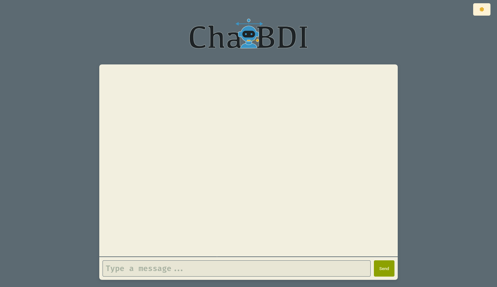

---

**ChatBDI** is an interpreter from Natural Language to KQML and vice versa.

It is implemented as a [JaCaMo](https://jacamo-lang.github.io/) agent that can be easily inserted inside a Multi-Agent System.

---

## Chat Interface

|                       **Chat Dark UI**                       |                      **Chat Light UI**                       |
| :----------------------------------------------------------: | :----------------------------------------------------------: |
|  |  |

## Installation

All the commands are intended from the root folder of the project.

### Chat Interface

First of all, to make the chat interface work you need `nodejs` installed on your computer. 

```bash
cd chat
npm install express
```

### Multi-Agent System

You may want a JaCaMo working installation. All the necessary instructions are at https://jacamo-lang.github.io/getting-started. However, for this project you only need [Gradle](https://gradle.org/) installed on your computer.

### Llama models

You need ollama installed on your computer. You can download it from the official website: https://ollama.com/.

## Usage

### Examples

To make the examples run you should follow this path:

1. Start the chat interface:
   ```bash
   cd chat
   node chat.js
   ```

   Open a browser at http://localhost:3000/chat.html

2. Start the Ollama daemon and create the necessary models:
   ```bash
   cd Llama\ Models/
   cd KMLQ2NL 
   ollama create kqml2nl -f Modelfile
   cd ../NL2KQML
   ollama create nl2kqml -f Modelfile
   cd ../NL2Performative
   ollama create nl2performative -f Modelfile
   ```
   If you want to try the DnD example you should use the `ModelfileDnD` in the `NL2KQML` folder.

3. Launch the JaCaMo example
   ```bash
   cd examples/dnd/
   gradle run
   ```

   If you want to try the auction example just:

   ```bash
   cd examples/auction_ag
   gradle run
   ```

And you are done.

It is possible that you have to launch the JaCaMo MAS more than once in order to be connected, sometimes Chat Interface does not connect correctly within the timeout.

### Inside an existing JaCaMO project

If you have an existing JaCaMo project just open the `.jcm` file and substitute the agent you want to impersonate with `interpreter/interpreter.asl`.

For example, given:

```jcm
mas jacamo {
	agent alice:alice.asl
	agent bob:bob.asl
}
```

If you want to impersonate Alice you should change it into:

```jcm
mas jacamo {
	agent alice:interpreter/interpreter.asl
	agent bob:bob.asl
}
```

And add a wait of at least 20 seconds at the beginning of each other agent for instrumentation.
